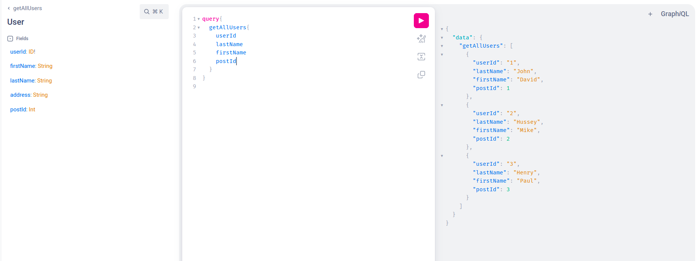

# graphQL-SpringBoot

Tryout the graphQL with spring boot and Mysql

Open the [URL](http://localhost:8080/graphiql?path=/graphql) to tryout graphQL Client.

Get All the users.

`query{
getAllUsers{
userId
firstName
lastName
address
post {
postName
postId
    }
}
}`

`mutation{
addUser (
firstName: "Hello",
lastName: "Kent",
address:"Sydney"
) {
userId
firstName
}
}`

`query{
getUserById (userId:100){
firstName
post {
postId
postName
}
}
}`

